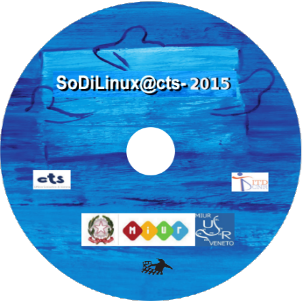

% Introduzione a So.Di.Linux
% Loris Tissino
   @loristissino 
  _loris@tissino.it_
% Marzo/Aprile 2017

# GNU/Linux e\ il\ software\ libero

## Le quattro libertà

- eseguire il programma per qualsiasi scopo
- studiare il programma e modificarlo
- ridistribuire copie del programma
- migliorare il programma e distribuirne pubblicamente i miglioramenti

(da [www.gnu.org/philosophy](https://www.gnu.org/philosophy/free-sw.it.html))

## Linux

Nucleo di un sistema operativo _Unix-like_ rilasciato con licenza GNU GPL nel 1991 da Linus Torvalds

## GNU/Linux

L'agglomerato nucleo + programmi di utilità e funzionalità aggiuntive provenienti dal progetto GNU

## Distribuzione

Raccolta di nucleo, utilità e programmi specifici,   
opportunamente configurati e testati   
per un'utenza generica o specialistica

Esistono centinaia di distribuzioni,  
nonché strumenti per\ crearne una\ propria  
a\ partire da\ una\ esistente

## Caratteristiche

- scelta delle applicazioni presenti
- configurazione dell'interfaccia utente
- modalità di distribuzione degli aggiornamenti
    - pacchetti
    - _repository_
    - programmi di aggiornamento/avanzamento

# Alcune distribuzioni

## Red Hat e derivate

- [Red Hat](https://it.wikipedia.org/wiki/Red_Hat_Linux)
- [Fedora](https://it.wikipedia.org/wiki/Fedora_(informatica))
- [CentOS](https://it.wikipedia.org/wiki/CentOS)

## Debian e derivate

- [Debian](https://it.wikipedia.org/wiki/Debian)
    - [Knoppix](https://it.wikipedia.org/wiki/Knoppix)
        - [EduKnoppix](https://it.wikipedia.org/wiki/Eduknoppix)
    - [Ubuntu](https://it.wikipedia.org/wiki/Ubuntu)
        - [Linux Mint](https://it.wikipedia.org/wiki/Linux_Mint)
            - So.Di.Linux

## Altre

- [Android](https://it.wikipedia.org/wiki/Android)
- [Gentoo](https://it.wikipedia.org/wiki/Gentoo_Linux)
    - [Sabayon](https://it.wikipedia.org/wiki/Sabayon)
- [Slackware](https://it.wikipedia.org/wiki/Slackware)
- ...

# Comunità di utenti

## Italian Linux Society

[www.ils.org](http://www.ils.org)

## Linux User Group

[mappa dei LUG](http://lugmap.linux.it/)

[PNLUG](https://www.pnlug.it/)

## Linux e didattica

[scuola.linux.it](http://scuola.linux.it/community)

- [Wii libera la lavagna](http://wiildos.it/)
- [So.Di.Linux](http://sodilinux.itd.cnr.it/)

# So.Di.Linux

## 

## Storia

- 2003, nasce come progetto  
dell'Istituto Tecnologie Didattiche del CNR
- 2010, continua senza finanziamenti
- 2015, collaborazione dei CTS

## Principi

- inclusività
- accessibilità
- usabilità

# Colophon

## Sorgente

[Questo documento](https://raw.githubusercontent.com/loristissino/sodilinux/master/index.md)

## Strumenti

- [Reveal.js](http://lab.hakim.se/reveal-js)
- [Pandoc](http://www.pandoc.org)

## Licenza

 «Introduzione a So.Di.Linux» di <a xmlns:cc="http://creativecommons.org/ns#" href="http://www.tissino.it/sodilinux/" property="cc:attributionName" rel="cc:attributionURL">Loris Tissino</a> è distribuito con Licenza  <a rel="license" href="http://creativecommons.org/licenses/by-sa/4.0/">Creative Commons Attribuzione Condividi allo stesso modo 4.0 Internazionale</a>.

